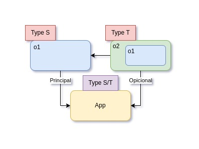
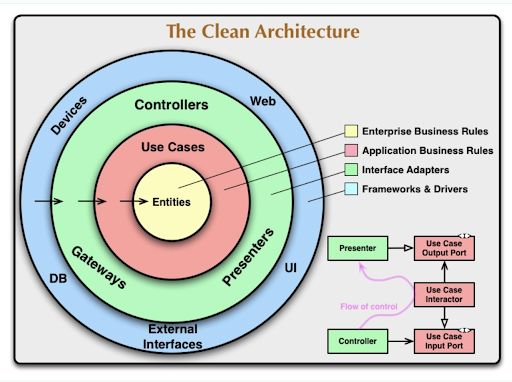
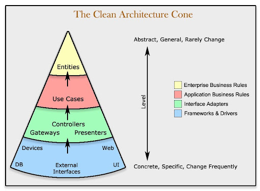
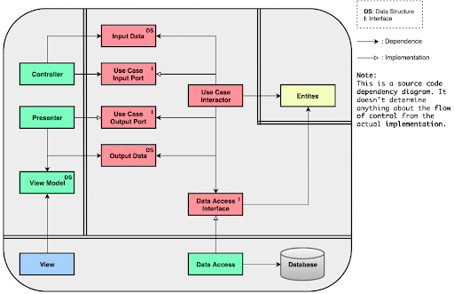
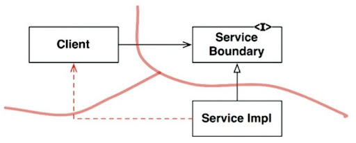
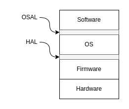
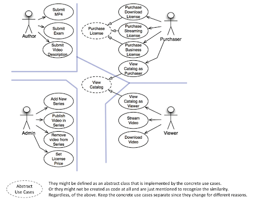
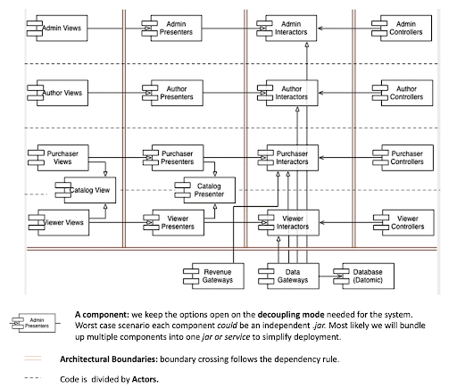
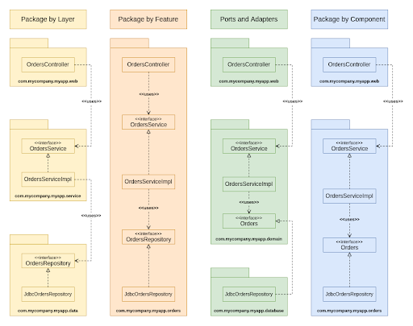

# Clean Architecture - notes

In this repository I put some notes that I think to be important.

## PART I - INTRODUCTION

### WHAT IS DESIGN AND ARCHITECTURE

The word “architecture” is often used in the context of something at a high level that is divorced from the lower level detail, whereas “design” more often seems to imply structures and decisions at a lower level. But this usage is nonsensical when you look at what a real architect does.

The low-level details and the high-level structure are all part of the same whole. They form a continuous fabric that defines the shape of the system. In short, Software architecture is more about the design of the entire system, while software design emphasizes on module / component / class level.

## PART II - STARTING WITH THE BRICKS: PROGRAMMING PARADIGMS

### STRUCTURAL PROGRAMMING

*Structured programming imposes discipline on direct transfer of control.*

Structured Programming Approach, as the word suggests, can be defined as a programming approach in which the program is made as a single structure. It means that the code will execute the instruction by instruction one after the other. It doesn’t support the possibility of jumping from one instruction to some other with the help of any statement like GOTO, etc. Therefore, the instructions in this approach will be executed in a serial and structured manner.

### OBJECT-ORIENTED PROGRAMMING

*Object-oriented programming imposes discipline on indirect transfer of control*

Object-oriented programming (OOP) is a computer programming model that organizes software design around data, or objects, rather than functions and logic. An object can be defined as a data field that has unique attributes and behavior. The structure, or building blocks, of object-oriented programming include the following:

- **Classes** are user-defined data types that act as the blueprint for individual objects, attributes and methods.
- **Objects** are instances of a class created with specifically defined data. Objects can correspond to real-world objects or an abstract entity. When class is defined initially, the description is the only object that is defined.
- **Methods** are functions that are defined inside a class that describe the behaviors of an object. Each method contained in class definitions starts with a reference to an instance object. Additionally, the subroutines contained in an object are called instance methods. Programmers use methods for reusability or keeping functionality encapsulated inside one object at a time.
- **Attributes** are defined in the class template and represent the state of an object. Objects will have data stored in the attributes field. Class attributes belong to the class itself.

Object-oriented programming is based on the following principles:

- **Encapsulation**: This principle states that all important information is contained inside an object and only select information is exposed. The implementation and state of each object are privately held inside a defined class. Other objects do not have access to this class or the authority to make changes. They are only able to call a list of public functions or methods. This characteristic of data hiding provides greater program security and avoids unintended data corruption.
- **Abstraction**: Objects only reveal internal mechanisms that are relevant for the use of other objects, hiding any unnecessary implementation code. The derived class can have its functionality extended. This concept can help developers more easily make additional changes or additions over time.
- **Inheritance**: Classes can reuse code from other classes. Relationships and subclasses between objects can be assigned, enabling developers to reuse common logic while still maintaining a unique hierarchy. This property of OOP forces a more thorough data analysis, reduces development time and ensures a higher level of accuracy.
- **Polymorphism**: Objects are designed to share behaviors, and they can take on more than one form. The program will determine which meaning or usage is necessary for each execution of that object from a parent class, reducing the need to duplicate code. A child class is then created, which extends the functionality of the parent class. Polymorphism allows different types of objects to pass through the same interface.

### FUNCTIONAL PROGRAMMING

*Functional programming imposes discipline upon assignment.*

Functional programming is a programming paradigm in which we try to bind everything in pure mathematical functions. It is a declarative type of programming style. Its main focus is on “what to solve” in contrast to an imperative style where the main focus is “how to solve”. It uses expressions instead of statements. An expression is evaluated to produce a value whereas a statement is executed to assign variables.

Concepts of functional programming:
- Pure functions
- Recursion
- Referential transparency
- Functions are First-Class and can be Higher-Order
- Variables are Immutable

Simple example:

**(prinln (take 25 (map (fn [x] (* x x)) (range) )))**

## PART III - DESIGN PRINCIPLES

### SOLID

- (SRP) The single responsibility principle: A class should have one and only one reason to change, meaning that a class should have only one job.

- (OCP) The open closed principle: Software entities (classes, modules, functions, etc.) should be open for extension, but closed for modification

- (LSP) Liskov substitution principle: If for each object o1 of type S there is an object o2 of type T such that for all programs P defined in terms of T, the behavior of P is unchanged when o1 is substituted for o2 then S is a subtype of T. in short: Subtypes must be substitutable for the base types

- (ISP) The interface segregation principle: A client should never be forced to implement an interface that it doesn’t use, or clients shouldn’t be forced to depend on methods they do not use.

- (DIP) The dependency inversion principle: Entities must depend on abstractions, not on concretions. It states that the high-level module must not depend on the low-level module, but they should depend on abstractions.

## PART IV - COMPONENT PRINCIPLES

### COMPONENT

- Components are the units of deployment. They are the smaller entities that can be deployed as part of a system.

### COMPONENT COHESION

- REP (Reuse / Release Equivalence): Classes and modules grouped into a component work for a single purpose and so should be releasable together with the same version number.

- CCP (Common Closure Principle): Classes and modules that change for the same purpose or reason(actor / stakeholder) at the same time should be gathered together in the same component.

- CRP (Common Reuse Principle): Don’t force users of a component to depend on things they don’t need, instead split them into different components.

### COMPONENT COUPLING

- (ADP) The acyclic dependencies' principle: this principle explains the reasons that the acyclic dependencies are bad for the growth of the project because it makes it more difficult to test, to develop and to build. Indeed, the best thing to do is to develop the project decoupled and more separated by components that could be deployed. To break the cycle, there are two solutions, the first is to use the dependency inversion principle, in a way to use an interface to do the inversion of responsibility and the second solution is create a new component that both depend on.

- Top-Down design: we can’t design the component structure from the top down and the component structure diagram can’t be designed before the project, because it emerges by the growing of the project.

- (SDP) The stable dependencies' principle: the focus of this principle is to make sure that the class dependencies are in the direction of stability. One sure way to make a software component difficult to change, is to make lots of other components depend on it. A component with lots of incoming dependencies is very stable because it requires a great deal of work to reconcile any changes with all the dependent components.

  - Stability metrics: said how we can measure the stability of a component: 
    - Fan-in (FI): incoming dependencies 
    - Fan-out (FO): outgoing dependencies
    - Stability (I) = FO / (FI+FO)
    - I = 1  unstable component = (FI = 0 and FO > 0)
    - I = 0 stable component = (FI > 0 and FO = 0)
  
- (SAP) The stable abstractions' principle: This principle says to design your software in such a way that components are as abstract as they are stable.  This supports the Stable Dependencies Principle and promotes flexibility by ensuring that stable components are easy to extend, even though they are hard to change.  This is achieved by applying the Open/Closed Principle, which enables us to easily extend functionality without modifying existing code.  This approach also works best when adhering to the Dependency Inversion Principle, which states that dependencies should point towards abstractions and not concretions.  This provides very effective Dependency Management for software components.

## PART V - ARCHITECTURE

### WHAT IS ARCHITECTURE?

- The architecture of a software system is the shape given to that system by those who build it. The form of that shape is in the division of that system into components, the arrangement of those components, and the way in which those components communicate with each other.

- The primary purpose of architecture is to support the life cycle of the system. Good architecture makes the system easy to understand, easy to develop, easy to maintain, and easy to deploy. The ultimate goal is to minimize the lifetime cost of the system and to maximize programmer productivity.

### INDEPENDENCE

- Use cases: indeed, the use cases are the first concern of the architect, and the first priority of the architecture. The architecture must support the use cases and the system will be plainly visible within the structure of this system.

- Operation: architecture plays a more substantial, and less cosmetic, role in supporting the operation of the system. If the system must handle 100,000 customers per second, the architecture must support that kind of throughput and response time for each use case that demands it.

- Development: architecture plays a significant role in supporting the development environment. The ultimate goal is to have an architecture that facilitates independent actions by teams, so the teams do not interfere with each other during the development.

- Deployment: a good architecture does not rely on dozens of little configuration scripts and property file tweaks. It does not require manual creation of directories or files that must be arranged just so. A food architecture helps the system to be immediately deployable after build.
Leaving options open: a good architecture makes the system easy to change, in all the ways that it must change, by leaving options open. This principle helps us partition our system into well-isolated components that allow us to leave as many options open as possible for as long as possible.

- Decoupling layers: a good architecture will want to separate the unstable layers from the stable layer. Example: separate the UI portion of a use case from the business rule portion in such a way that they can be changed independently of each other, while keeping those use cases visible and clear.

- Decoupling use cases: use cases are a very natural way to divide the system. To achieve this decoupling, we normally separate the horizontal layers (UI, database, business rules, etc…) and we also divide the system into vertical use cases that cut through those layers.

- Decoupling mode: operation is the main goal here. If the different aspects of the use cases are separated, then those that must run at a high throughput are likely already separated from those that must run at a low  throughput. The point being made here is that sometimes we have to separate our components all the way to the service level.

- Independent develop-ability: so long as the layers and use cases are decoupled, the architecture of the system will support the organization of the teams, irrespective of whether they are organized as features team, component teams, lyer teams, or some other variation.

- Independent deploy-ability: the decoupling of the use cases and layers also afford a high degree of flexibility in deployment. Indeed, if the decoupling is done well, then it should be possible to hot-swap layers and use cases in running systems.

- Duplication: the important thing in this point is to know what is a true and false duplication, where only when we have a true duplication we must do some changes or fixes. To identify if one code is duplicated, follow this tip: True duplication happens when every change to one instance necessitates the same change to every duplicate of that instance and the false or accidental duplication is when two apparently duplicated section of code evolve along different paths, if they change at different rate, and for differentes reasons, then, they are not true duplicates.

- Decoupling modes (Again): There are many ways to decouple layers and use cases, they can be decoupled at:

  - Source level
  - Deployment level
  - Service level 

  A good architecture will allow a system to be born as monolith, deployed in a single file, but then to grow into a set of independently deployable units, and the all the way to independent service and/or micro-services. Later, as things change, it should allow for reversing that profession and sliding all the way back down into a monolith.

### BOUNDARIES: DRAWING LINES

To draw boundary lines in a software architecture, you first partition the system into components. Some of those components are core business rules; others are plugins that contain necessary functions that are not directly related to the core business. Then you arrange the code in those components such that the arrows between them point in one direction - Toward the core business. You should recognize this as an application of the Dependency inversion Principle and the Stable Abstraction Principle. Dependency arrows are arranged to point from lower-level details to higher-level abstractions

### BOUNDARY ANATOMY

Most systems, other than monoliths, use more than one boundary strategy. A system that makes use of service boundaries may also have some local process boundaries. Indeed, a service is often just a dacade for a set of interacting local processes. A service, or a local process, will almost certainly be either a monolith composed of source code components or a set of dynamically linked deployment components. This means that the boundaries in a system will often be a mixture of local chatty boundaries and boundaries that are more concerned with latency.

### POLICY AND LEVEL

Software systems are statements of policy. In other words, a computer program is a detailed description of policies that converts the inputs it receives to output. In most important systems, policy can be broken down to be expressed in smaller policies. The division of these policies into smaller pieces and grouping them according to what has been changed is part of the development of software architecture. The concept of this level, whether high or low, is determined by proximity to input and output. The more distant a policy is from input and output, the higher the level. Those who manage input and output are considered the lowest-level policies of the system.

### BUSINESS RULES

Business rules are the reason a software system exists. They are the core functionality. They carry the code that makes, or saves, money. They are the family jewels. The business rules should remain pristine, unsullied by baser concerns such as the user interface or database used. Ideally, the code that represents the business rules should be the heart of the system, with lesser concerns being plugged into them. The business rules should be the most independent and reusable code in the system.

### SCREAMING ARCHITECTURE

Your architecture should tell readers about the system, not about the frameworks you used in your system. If you are building a health care system, then when new programmers look at the source repository, their first impression should be, “Oh, this is a health care system.” Those new programmers should be able to learn all the use cases of the system, yet still not know how the system is delivered. They may come to you and say:

- “We see some things that look like models, but where are the views and controllers?”

And you should respond:

- “Oh, those are details that need’t concern us at the moment. We’ll decide about them later.”

### THE CLEAN ARCHITECTURE

Architectures need to produce systems with the following characteristics:

- Framework-independent
- Testable
- UI independent
- Database independent
- Independent of any agency

The above circles represent different areas of software. As you move to the inside circles, the level of software increases. The outside circles represent the mechanisms. The inner circles represent the policies. A circle located inside does not have information about the circles located outside. At the same time, the data structures that will not be used by the inside circles should be defined in the outside circles.

Conforming to these simple rules is not difficult, and it will save you a lot of headaches going forward. By separating the software into layers and conforming to the Dependency Rules, you will create a system that is intrinsically testable, with all the benefits that implies. When any of the external parts of the system become obsolete, such as the database, or the web framework, you can replace those obsolete elements with a minimum of fuss.

A typical scenario :

### PRESENTERS AND HUMBLE OBJECT

Presenters are a form of the humble object pattern, which helps us identify and protect architectural boundaries. The humble object pattern is a design pattern that was originally identified as a way to help unit testers to separate behavior that are hard to test from behaviors that are easy to teste.

At each architectural boundary, we are likely to find the humble Object pattern lurking somewhere nearby. They communication across that boundary will almost always involve some kind of simple data structure, and the boundary will frequently divide something that is hard to test from something that is easy to test. The use of this pattern of architectural boundaries vastly increases the testability of the entire system.

### PARTIAL BOUNDARIES

Full-fledged architectural boundaries are expensive. They require reciprocal polymorphic Boundary interfaces, INput and Output data structure, and all of the dependency management necessary to isolate the two sides into independently compilable and deployable components. That takes a lot of work. It’s also a lot of work to maintain.

For this reason, there are many situations where a good architect might judge that the expense of such a boundary is too high. This kind of anticipatory design is often frowned upon by many in the Agile community as a violation of **YAGNI: “You aren’t going to need it”**

- Skip the last step: One way to create a partial boundary is to create independent components that can do all the necessary work, then collect them all in one component. Everything required (interface, input / output, etc.) is set in the same way, but all can be compiled and deployed as a single component. Although it requires as much code and design as it needs to literally build a boundary, it eliminates the problem of managing multiple components. There is also no payload to track version number or manage release.

- One dimensional boundaries: In a full-fledged boundary, the separation of maintenance for both sides is very costly in terms of initial setup and maintenance.

  

  As shown in the diagram above, such situations may result in architectural boundaries in the future. Dependency inversion plays a role in the separation of Client and ServiceImpl. It should be clearly stated that this decomposition can rapidly deteriorate, as indicated by dotted arrows. Without mutual interfaces, it will not be possible to prevent such backdoors from the diligence and discipline of developers and architects.

- Facade: boundaries are defined by Facade classes. In these Facade classes, all services are listed in methods and service calls are distributed to classes that should not be accessed by the client.

### LAYERS AND BOUNDARIES

Architectural boundaries are available everywhere. However, like a good software architect, you must see the future. You must guess - intelligently. You must weigh the cost and determine where the architectural boundaries lie, and which should be fully implemented, and which should be partially implemented, and which should be ignored.

But this is not a one-time decision. You don’t simply decide at the start of a project which boundaries to implement and which to ignore. Rather, you watch. You pay attention as the system evolves. You note where boundaries may be required, and then carefully, watch for the first inkling of friction because those boundaries don’t exist.

At that point, you weigh the costs of implementing those boundaries versus the cost of ignoring them - and you review that decision frequently. Your goal is to implement the boundaries right at the inflection point where the cost of implementing becomes less than the cost of ignoring

It takes a watchful eye.

### THE MAIN COMPONENT

The Main component is the ultimate detail—the lowest-level policy. It is the initial entry point of the system. Nothing, other than the operating system, depends on it. Its job is to create all the Factories, Strategies, and other global facilities, and then hand control over to the high-level abstract portions of the system.

### SERVICES: GREAT AND SMALL

Service-oriented “architectures” and microservice “architectures” have become very popular of late. The reasons for their current popularity include the following:

- Services seem to be strongly decoupled from each other.

- Services appear to support independence of development and deployment.

As useful as services are to the scalability and develop-ability of a system, they are not, in and of themselves, architecturally significant elements. The architecture of a system is defined by the boundaries drawn within that system, and by the dependencies that cross those boundaries. That architecture is not defined by the physical mechanisms by which elements communicate and execute.

A service might be a single component, completely surrounded by an architectural boundary. Alternatively, a service might be composed of several components separated by architectural boundaries. In rare cases, clients and services may be so coupled as to have no architectural significance whatsoever.

### THE TEST BOUNDARY

The tests are part of the system, and they participate in the architecture just like every other part of the system does. Tests are the most isolated system component. In fact you can think of the tests as the outermost circle in the architecture. Nothing within the system depends on the tests, and the tests always depend inward on the components of the system. One important thing is that tests are independently deployable.
When we think about design for tests, there are some important points to analyze. One of these things is tests that are not well integrated into the design of the system tend to be fragile, and they make the system rigid and difficult to change, so the issue of course, is coupling. The first thing to solve this problem is don’t depend on volatile things.

### CLEAN EMBEDDED ARCHITECTURE

This chapter is about the rules to develop a clean embedded architecture. Some important phrases:

*“Although software does not wear out, firmware and hardware become obsolete, thereby requiring software modifications”*

Non-embedded engineers also write firmware! You non-embedded developers essentially write firmware whenever you bury SQL in your code or when you spread platform dependencies through your code. Android app developers write firmware when they don’t separate their business logic from the android api.

A clean embedded architecture is testable within the layers because modules interact through interfaces. Each interface provides that seam or substitution pont that facilitates off-target testing.

HAL - Hardware abstraction layer

OSAL - Operating System abstraction layer

## PART VI - DETAILS

### THE DATABASE IS A DETAIL

The organizational structure of data, the data model, is architecturally significant. The technologies and systems that move data on and off a rotating magnetic surface are not. A relational database system that forces the data to be organized into tables and accessed with SQL has much more to do with the latter than with the former. The data is significant. The database is a detail.

### THE WEB IS A DETAIL

It has a long history of pendulum swings from centralizing computing power (e.g. server rendered pages), to distributing it (e.g. front end apps) and back. As architects, we want to shield our business from those swings and be able to adapt to the swings.

The philosophical bottom line is the GUI is a detail and the web is a GUI. The web is nothing more than an IO device and hence we should try to isolate it from our business logic. The practical bottom line is that with ultra-rich web UIs that constantly communicate with the servers, aiming for full device independence in all interactions might be impractical.

### FRAMEWORKS ARE DETAILS

Frameworks are powerful and useful, but they are not architectures. Use frameworks but try not to marry them. If you marry into a framework, make sure that it is a conscious decision and that the team understands that it will be part of your application forever (until you rewrite it).

### CASE STUDY: VIDEOS SALES

Use-case analysis

A preliminary component architecture

### THE MISSING CHAPTER

#### PACKAGE BY LAYER

This design approach is the traditional horizontal layered architecture, where we separate our code based on what it does from a technical perspective. In this typical layered architecture, we have one layer for the web code, one layer for our “business logic,” and one layer for persistence.

It’s a very quick way to get something up and running without a huge amount of complexity. The problem is that once your software growns in scale and complexity, you will quickly find that having three large buckets of code isn’t sufficient, and you will need to think about modularizing further.

Another problem is that, as Uncle Bob has already said, a layered architecture doesn't scream anything about the business domain.

#### PACKAGE BY FEATURE

This is vertical slicing, based on related features, domain concepts, or aggregate roots (to use domain-driven design terminology). In the typical implementation, all of the types are placed into a single package, which is named to reflect the concept that is being grouped.

With this approach we can see that this code base has something to do with orders rather than the web, services, and repositories. Other than that, it's potentially easier to find all of the code that you need to modify in the event that the “view orders” use case changes.

#### PORTS AND ADAPTERS

Approaches such as “ports and adapters”, the “hexagonal architecture,” “boundaries, controller, entities,” and so on aim to create architecture where business/domain-focused code is independent and separate from the technical implementation details such as frameworks and databases. To summarize, we often see such code bases being composed of an “inside” (domain) and an “outside” (infrastructure).

#### PACKAGE BY COMPONENT

It’s a hybrid approach to everything we’ve seen so far, with the goal of bundling all the responsibilities related to a single coarse-grained component into a single package. It’s about taking a service-centric view of a software system, which is something we’re seeing with microservice architectures as well.

In the same way that ports and adapters treat the web as just another delivery mechanism, “package by component” keeps the user interface separate from these coarse-grained components.

In essence, this approach bundles up the “business logic” and persistence code in a single thing, which I’m calling a “component”.

